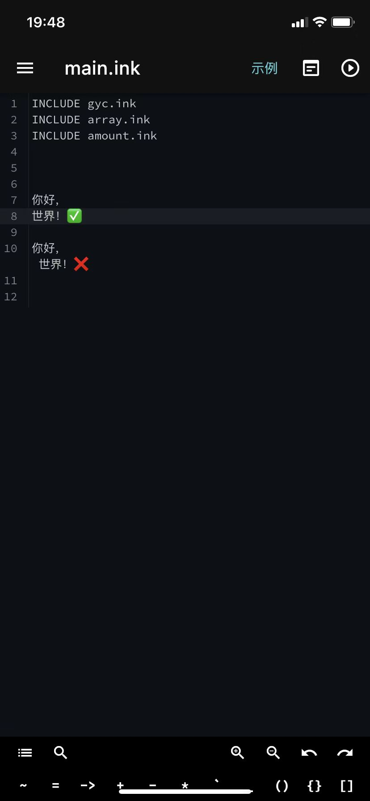

# 基本

这里将介绍创作一个文字冒险的基础知识，如果你可以掌握，那么你就可以进行文字冒险的基本创作了

[TOC]


#### 代码的读取

打开编译器界面，看到屏幕左边的数字了吗？正常情况下（指没有跳转的时候）系统将按照从上往下的顺序依次读取每行的内容，而这些内容将会被编译成各种文本，抑或是修改变量，抑或是调用各种函数，抑或是进行各种跳转......产生各种奇妙的效果。

##### 实验

现在，不要去管开头几行带有INCLUDE字样的代码，试着直接另起一行，输入“你好，世界！”，而后点击屏幕最右上角的播放键试试看。

你将看到，在没有任何操作的情况下，字样直接在屏幕上显示出来了。


现在，回到编译器界面，试着利用换行，将开头的那一堆INCLUDE和你刚刚输入的“你好，世界！”之间隔开几行，然后继续点右上角的播放键（其实是运行）

你将看到，还是和刚才一样，在没有任何操作的情况下，字样直接在屏幕上显示出来了。


现在，回到编译器界面，试着在“你好，”和“世界”之间换行，将它们分为两行，（注意：这里的”行“以左侧数字为准，分处不同数字标记下的代码才处于不同行）



运行你的代码，你会发现，在没有然后后续操作的情况下，屏幕上仅仅跳出了”你好，“。


现在，点击屏幕试试，你会发现，“世界！”也冒出来了。

##### 知识点

1. 系统将按照从上往下的顺序依次读取每行的内容

2. ”行“以左侧数字为准，分处不同数字标记下的代码才处于不同行

3. 想象在游戏运行时，编译器界面出现一根无形的针，玩家每点击一次屏幕，针就会下移一行，如果编译器某一行被针戳中，系统将会把这一行代码编译并且呈现在游戏界面上。

4. 遇到**不属于**能输出文字到玩家屏幕上的代码，

   > *例如：看不到任何东西的一行；用来进行定义，赋值，运算等工作的一行；用来写注释的一行；用来划分节点和函数的一行；用来跳转的一行；用来包含文件的一行（就那个include）....等等。*

   系统会立即执行这行代码，同时这个针会自动下移一行，直到遇到可以输出文字到玩家屏幕上的代码，它才会停在这行，同时系统将会运行这行代码，当玩家点击屏幕之后，针才能下移。

5. 游戏开始的那一刻，这根针就自动出现在第一行，随后系统立刻开始运行，直到遇到第一句话才会停下并且同时运行，将它显示到游戏屏幕上（指能输出文字到玩家屏幕上的代码）

#### 基本节点与基本跳转

##### 实验

现在，在“你好，“和”世界”之间插入一行，写下以下内容：

```
== a ==
```

如果成功的话，你会看到这行字变黄了。

那么试着运行一下游戏，你会发现，屏幕上在跳出你好之后，不论再怎么点击屏幕都无济于事，系统显示游戏结束。


现在，在“你好，”和”== a ==“之间插入一行，写下 -> a  

那么，你应该会看到这样的内容：

```
你好，
-> a
== a ==
世界！
```

不出意外的话，箭头那一行会变蓝。

现在试着运行一下，你会发现世界也可以显示了。


现在，输入一些内容，将代码变成这样：

```

-> a
== a ==
111
222
333
== b ==
444
555
666
```

试着运行，你会发现，屏幕上仅仅能够显示到111，222，333，然后就结束了。


那么将箭头后的a改成b呢？

```

-> b
== a ==
111
222
333
== b ==
444
555
666
```

试着运行，你会发现，屏幕上仅仅能够显示到444，555，666，然后就结束了。


看到这里，我想你一定已经明白箭头的作用，以及这根针是如何移动的吧。

现在，在最后加上"-> a",

```

-> b
== a ==
111
222
333
== b ==
444
555
666
-> a
```

然后运行试试看呢？

你将看到，随着点击，屏幕上出现了444，555，666，111，222，333


好了，我想聪明的你一定可以想到，如何让系统顺次输出111，222，333，444，555，666，


没错，就是这样！

```

-> a
== a ==
111
222
333
-> b
== b ==
444
555
666

```


emmm。。。现在提高一些难度，试着让屏幕不断重复出现111，222，333，111，222，333，111，222，333，111.........


好吧，看来这也应该是难不到你的，

```

-> a
== a ==
111
222
333
-> a
== b ==
444
555
666

```


呃。。那么循环输出111，222，333，444，111，222，333，444，......这样呢？


答案是这样的，

```

-> a
== a ==
111
222
333
-> b
== b ==
444
-> a
555
666

```


##### 知识点

1. 节点相当于一种标记，由等号和字母数字下划线组成“== abc_123 =="
2. 这种箭头“->”是跳转标志，箭头后填写节点的名称就可以让移动到这行的针瞬间跳转到对应的节点标记处的下方第一行"-> abc_123"
3. 针移动到节点标记之后，游戏就结束了。。。所以不要让针有机会接触到节点标记！！！


#### 基础选项

##### 实验

现在，清空除了INCLUDE那些之外的所有内容，然后空几行，输入一个星号”*“，星号的后面输入” 选a“

```
* 选a
```

接下来运行代码试试看

然后你会看到，屏幕中出现了一个蓝框，点击它，屏幕上蓝框消失，随之多出来”选a“的字样。


现在，在下面加一些东西：

```
* 选a
111
222
333
* 选b
444
555
666
```

接下来运行代码试试看

然后你会看到，屏幕中出现了两个蓝框，一个”选a“，一个”选b“

点击”选a“，屏幕上两个蓝框全部消失了，接着屏幕上出现了 选a，111，222，333的字样，可是接下来继续点，游戏就结束了。


那么，你试试看有没有什么方法，可以顺次显示出111,222,333,444,555,666的所有数字呢？


或许你的第一个尝试是这样的：

```
->a
== a ==

* 选a
111
222
333

* 选b
444
555
666

->a
```

emmm...这虽然看起来好像有那么些感觉了，然而当你再一次运行它时，会发现选a之后依然游戏结束。

选b可以显示出444，555，666，而后屏幕上再次跳出选项，但不同的是，这次只剩下”选a“这一个选项了。


你注意到了问题，于是便将两个选项最后都加上了跳转：

```
->a
== a ==

* 选a
111
222
333
->a

* 选b
444
555
666
->a
```

成功了，经过两次选择之后，屏幕上显示了111，222，333，444，555，666


或许你注意到了一个问题：在第二次进行选择时，已经选过的选项将不再出现，以至于当你第三次进行选择时，将没有选项可选。


那么，请将*换成+再试试看呢？

```
->a
== a ==

+ 选a
111
222
333
->a

+ 选b
444
555
666
->a
```

运行之后，你发现，这些选项是可以无限次重复被选择的，你创建了一个循环。


现在，将代码修改成这样：

```
->a
== a ==

+ 选a
111
222
333
进行了一次选择
->a

+ 选b
444
555
666
进行了一次选择
->a
```

你会发现，无论选a还是选b，最终都会显示”进行了一次选择“然后跳转到节点a。


在从上往下最后一个选项的最下端，另起一行输入减号”-“，可以将多个选项收束，这意味着，当你进入以上任意一个选项之后，且当该选项的代码运行到最底端，针会自动跳转到”-“所在的那一行，然后继续运行。

```
->a
== a ==

+ 选a
111
222
333

+ 选b
444
555
666

- 进行了一次选择
->a
```


现在，在”选a“外面加上一个方括号”[ ]“

```
->a
== a ==

+ [选a]
  111
  222
  333

+ 选b
  444
  555
  666

- 进行了一次选择
  ->a
```

接着运行它，你会发现，当你选择a之后，屏幕上并不会跳出“选a”的字样，而是直接跳出接下来的111，222，333


##### 知识点

1. 选项标志”*“”+“都可以创建选项，区别在于星号只能使用一次，而加号没有限制，因此我推荐使用加号。
2. 当针运行到有选项标志的那一行，系统会立刻向下检索有选项标志的其他行，并且将所有选项标志后，处于同一行内的文本显示出来作为选项，变成蓝底白字投射到玩家的屏幕上。当玩家选择了某一个选项之后，针会跳转到那个选项标志所在的行，并且立即向下移动一行。当针在不经过跳转的前提下，再次遇到同级（同级的概念会在之后提到）的选项标志时，会向下在同一节点内检索同级的收束标志”-“，若找不到，游戏就会结束。
3. 收束标志”-“会让针走完一个选项并且被检索之后，跳转至这一行，并运行这一行的代码


